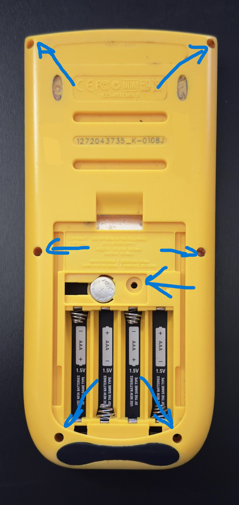
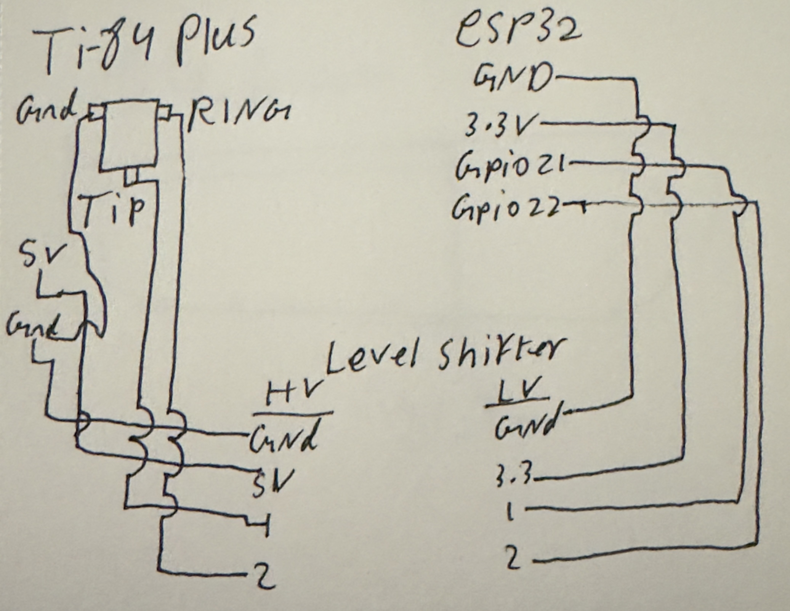
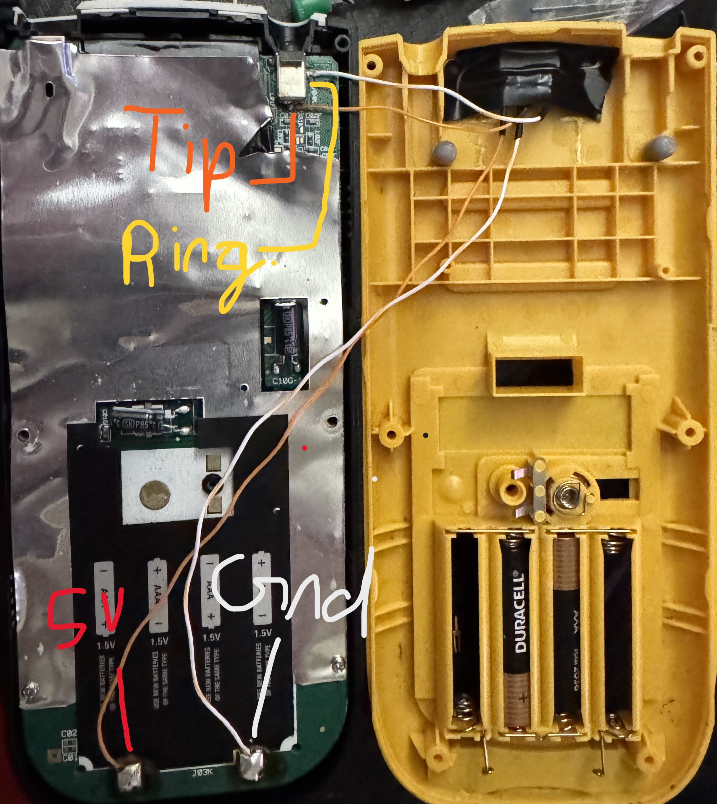

# TI-116_Plus
A special thanks to John from the UTD IEEE Discord server, and to Chromalock and KermMartian for their help with the libraries and starter code.

⚠️ **Warning: This guide does not encourage cheating with the TI-116 Plus.**

**Uncle Ben-“With great power comes great responsibility”**

## Required Components & Tools:

- TI-84 Plus
- ESP32
- Bidirectional 5V-to-3.3V level shifter
- Wires
- Female and male 5-pin headers
- Soldering iron
- Heat shrink tubing
- Electrical tape
- Torx T6 screwdriver (for the outer screws)  
- Phillips screwdriver (for the backup battery)

  ## Step 1: Open the Calculator

1. Use the **Torx T6 screwdriver** to remove the outer screws.  
2. Carefully lift the back cover.  
3. Use the **Phillips screwdriver** to remove the screw holding the backup battery in place.

  

## Step 2: Wiring ✅

## Step 2: Wiring
- TI-84 Plus
- ESP32
- Bidirectional 5V-to-3.3V level shifter
- Wires
- Soldering iron
- Heat shrink tubing
- Electrical tape

  

## Bonus: Access Port
- A port for experimentation, power output, and access to IO pins.

  

## Step 3: Reassemble the Calculator

  

## Step 4: CODE!!!!!!!!!!!!!!!!!!!!!!!!

### [Download the libraries here](https://github.com/KermMartian/ArTICL)
  

  

  

### Next go to [Code_For_ESP32](https://github.com/ssohail-droid/TI-116_Plus/blob/main/Code_For_ESP32/ESP32)

- Copy and paste the code into your project.
- Replace the placeholders with your own credentials:
  - API key
  - Wi-Fi SSID
  - Wi-Fi password
- Push code to the ESP 32

### Next go to [Code_For_TI-84 Plus](https://github.com/ssohail-droid/TI-116_Plus/blob/main/Code_For_TI-84_Plus)
- Get [TI Connect](https://education.ti.com/en/products/computer-software/ti-connect-sw#lightbox=ti-connect-ce-get-the-right-version)
- Copy and paste the code into your project

  

  

  

